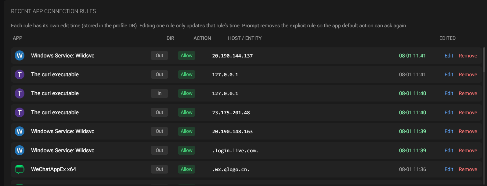
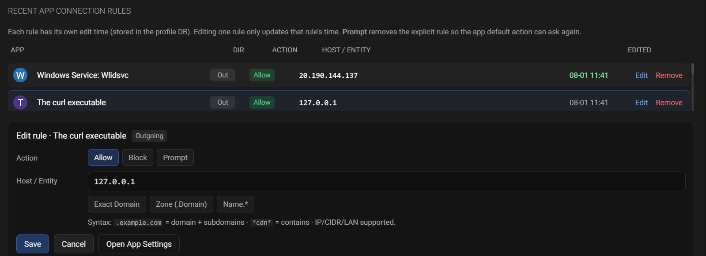

# Portmaster Modify

> **说明**：本仓库是 [Safing/Portmaster](https://github.com/safing/portmaster) 的 **非官方修改版**（fork），在 GPL-3.0 下发布。  
> 与官方无隶属关系；商标与品牌归 Safing 所有。SPN 等云端付费服务仍以官方账号/套餐为准。

基于上游 Portmaster，本修改版主要调整如下。

## 本仓库修改说明

### 1. 免费启用原 Plus 能力（本地功能）

无需登录 Safing 账号、无需 Plus 套餐即可使用：

| 功能 | 官方 | 本修改版 |
|------|------|----------|
| **Bandwidth Visibility**（带宽可视） | Plus（`bw-vis`） | 默认可用 |
| **Network History**（网络历史） | Plus（`history`） | 默认可用（仍尊重应用内「启用历史」开关） |

> SPN 等依赖官方网络与订阅的功能 **未** 解锁。

### 2. Dashboard：近期带宽可视

- **Recent Top Consumers**：按应用汇总收/发流量（环形图）
- **Recent Bandwidth Usage**：近期总带宽时序（折线图）


### 3. Dashboard：按日 / 周 / 月的应用流量统计（新增）

新增 **App Bandwidth by Period**：

- 切换 **Day / Week / Month**
- 周期内 **总下载 / 总上传 / 合计**
- 按应用横向柱状图（绿=下载，蓝=上传）
- 显示应用图标与名称
- 数据持久化在本地 `history.bandwidth_app_daily`（`history.db`）


### 4. 联网 Prompt 通知更易识别

系统通知（Windows toast）调整：

- **标题**：应用名称（不再固定为 “Connection Prompt”）
- **正文**：精简可执行路径 + 目标（如 `父目录\程序.exe → example.com`）
- 路径过长时自动缩短，兼顾通知栏长度

### 5. Dashboard：最近应用连接规则（新增）

新增 **Recent App Connection Rules**，集中查看并快速改写各应用的出站 / 入站规则，无需逐个进入 App 设置页。

#### 列表

- 展示各应用的 Outgoing / Incoming 规则（Allow / Block）
- 显示应用图标、方向、动作、主机（域名 / IP）、**逐条编辑时间**
- 按编辑时间倒序排列，便于处理刚通过 Prompt 或连接菜单新增的规则
- 时间保存在 profile 数据库（`filter/ruleEditTimesJson`）；**修改一条只更新该条时间**，不会带动同 App 其它规则



#### 就地编辑

点击 **Edit** 展开编辑面板：

| 能力 | 说明 |
|------|------|
| **Allow / Block** | 写入 `+` / `-` 规则（引擎原生支持） |
| **Prompt** | 删除该条明确规则，流量回落到应用默认动作（常为 Ask） |
| **Host / Entity** | 可改 IP、域名、通配符、CIDR、LAN 等 |
| **Exact Domain** | 收敛为精确域名 |
| **Zone (.domain)** | 改为 `.example.com`（含主域与子域） |
| **name.*** | 前缀通配快捷 |
| **Open App Settings** | 跳转到该应用完整设置页 |



#### 规则语法提示

- `.example.com`：主域 + 所有子域  
- `example.com`：仅该 FQDN  
- `*cdn*`：包含匹配  
- IP / CIDR / `LAN` / `Internet` 等同样支持  
- 引擎层规则本身只有 Allow/Block；Prompt 通过“删除规则”实现，不是第三条规则类型  

### 6. 分支说明（本 fork）

| 分支 | 用途 |
|------|------|
| `development` | 跟踪官方干净基线 |
| `modify` | 仅包含本仓库改动 |
| `main` | 官方基线 + 本仓库改动（默认发布分支） |

同步上游示例：

```bash
git fetch origin
git checkout development && git merge origin/development
git checkout modify && git merge development
git checkout main && git merge modify
```

### 7. Windows 本机精简打包与安装

官方完整发布依赖 Earthly/Docker 多平台构建与安装器流水线。本修改版日常迭代更适合 **精简打包**：只重编 **Core + UI**，覆盖已安装目录中的两个文件即可验证功能（与本仓库开发时的替换方式一致）。

#### 背景说明

| 组件 | 文件 | 是否需要自编 |
|------|------|----------------|
| 核心服务 | `portmaster-core.exe` | **是**（Go） |
| Web UI | `portmaster.zip` | **是**（Angular） |
| 桌面壳 | `portmaster.exe` | 否（可用现有安装） |
| 驱动 / DLL | `portmaster-kext.sys`、`portmaster-core.dll` 等 | 否（沿用官方二进制） |

- UI 由 Core 从同目录的 `portmaster.zip` 加载。  
- 日/周/月流量等数据写在本机数据目录（如 `C:\ProgramData\Portmaster\databases\history.db`），与打包方式无关。  
- 精简包 **不是** 官方 NSIS/MSI 安装器；分发时请标明非官方修改版。

#### 一键脚本

脚本路径：

```text
packaging/windows/dev_helpers/build_local_package.ps1
```

依赖：已安装 **Go**、**Node.js/npm**；使用 `-Install` 时需管理员权限（UAC）。

```powershell
cd packaging\windows\dev_helpers

# 仅编译打包（production UI）
.\build_local_package.ps1

# 开发配置 UI + npm 代理
.\build_local_package.ps1 -Development -Proxy http://127.0.0.1:1086

# 编译并安装到本机（默认 D:\app\Portmaster，会弹 UAC）
.\build_local_package.ps1 -Install -InstallDir "D:\app\Portmaster"

# 已有产物，只重新安装
.\build_local_package.ps1 -SkipCore -SkipUI -Install
```

常用参数：

| 参数 | 说明 |
|------|------|
| `-Development` / `-d` | UI 使用 development 配置 |
| `-Proxy <url>` | npm 使用 HTTP 代理 |
| `-GoProxy <url>` | 默认 `https://goproxy.cn,direct` |
| `-SkipNpmInstall` | 跳过 `npm install` |
| `-SkipCore` / `-SkipUI` | 跳过对应编译 |
| `-Install` | 停止服务、备份、替换、重启 `PortmasterCore` |
| `-InstallDir` | 安装目录，默认 `D:\app\Portmaster` |
| `-NoBackup` | 安装时不备份旧文件 |

#### 产物

```text
packaging/windows/dev_helpers/dist/local-package/
  portmaster-core.exe
  portmaster.zip
  REPLACE.txt
```

#### 手动替换步骤（不用 `-Install` 时）

1. 停止服务 `PortmasterCore`，并退出桌面端 `portmaster.exe`  
2. 备份安装目录中的 `portmaster-core.exe`、`portmaster.zip`  
3. 将产物复制到安装目录（示例：`D:\app\Portmaster\`）  
4. 启动服务 `PortmasterCore`  
5. **完全退出后重新打开** 桌面端（仅刷新页面可能仍是旧 UI）

#### 与官方完整打包的关系

若需要 `.exe`/`.msi` 安装包，请参考仓库 `packaging/README.md` 与 `earthly +release-prep` 流程（通常需 Linux + Docker/Earthly，再在 Windows 上生成安装器）。精简脚本 **不替代** 该流程。

---

# Get Peace of Mind <br> with [Easy Privacy](https://safing.io/)

Portmaster is a free and open-source application firewall that does the heavy lifting for you.
Restore privacy and take back control over all your computer's network activity.

With great defaults your privacy improves without any effort. And if you want to configure and control everything down to the last detail - Portmaster has you covered too. Developed in the EU 🇪🇺, Austria.

__[Download for Free](https://safing.io/download/)__

__[About Us](https://safing.io/about/)__


_seen on:_  

[](https://www.heise.de/tests/Datenschutz-Firewall-Portmaster-im-Test-9611687.html)
&nbsp;&nbsp;&nbsp;
[](https://www.ghacks.net/2022/11/08/portmaster-1-0-released-open-source-application-firewall/)
&nbsp;&nbsp;&nbsp;
[](https://www.youtube.com/watch?v=E8cTRhGtmcM)
&nbsp;&nbsp;&nbsp;
[](https://lifehacker.com/the-lesser-known-apps-everyone-should-install-on-a-new-1850223434)

## [Features](https://safing.io/features/)

1. Monitor All Network Activity
2. Full Control: Block Anything
3. Automatically Block Trackers & Malware
4. Set Global & Per‑App Settings
5. Secure DNS (Doh/DoT)
6. Record and Search Network Activity（本修改版默认可用；官方为 [$](https://safing.io/pricing/)）
7. Per-App Bandwidth Usage（本修改版默认可用，并增强日/周/月统计；官方为 [$](https://safing.io/pricing/)）
8. [SPN, our Next-Gen Privacy Network](https://safing.io/spn/) ([$$](https://safing.io/pricing/))

# Technical Introduction

Portmaster is a privacy suite for your Windows and Linux desktop.

### Base Technology

- Portmaster integrates into network stack using nfqueue on Linux and a kernel driver (WFP) on Windows.
- Packets are intercepted at the raw packet level - every packet is seen and can be stopped.
- Ownership of connections is found using eBPF and `/proc` on Linux and a kernel driver and the IP Helper API (`iphlpapi.dll`) on Windows.
- Most settings can be defined per app, which can be matched in different ways.
- Support for special processes with weird or concealed paths/actors:
  - Snap, AppImage and Script support on Linux
  - Windows Store apps and svchost.exe system services support on Windows
- Everything is 100% local on your device. (except the SPN, naturally)
  - Updates are fully signed and downloaded automatically.
  - Intelligence data (block lists, geoip) is downloaded and applied automatically.
- The Portmaster Core Service runs as a system service, the UI elements (App, Notifier) run in user context.
- The main UI still uses electron as a wrapper :/ - but this will change in the future. You can also open the UI in the browser

### Feature: Secure DNS

- Portmaster intercepts "astray" DNS queries and reroutes them to itself for seamless integration.
- DNS queries are resolved by the default or configured DoT/DoH resolvers.
- Full support for split horizon and horizon validation to defend against rebinding attacks.

### Feature: Privacy Filter

- Define allowed network scopes: Localhost, LAN, Internet, P2P, Inbound.
- Easy rules based on Internet entities: Domain, IP, Country and more.
- Filter Lists block common malware, ad, tracker domains etc.

### Feature: Network History ($)

- Record connections and their details in a local database and search all of it later
- Auto-delete old history or delete on demand

### Feature: Bandwidth Visibility ($)

- Monitor bandwidth usage per connection and app

### Feature: SPN - Safing Privacy Network ($$)

- A Privacy Network aimed at use cases "between" VPN and Tor.
- Uses onion encryption over multiple hops just like Tor.
- Routes are chosen to cover most distance within the network to increase privacy.
- Exits are chosen near the destination server. This automatically geo-unblocks in many cases.
- Exclude apps and domains/entities from using SPN.
- Change routing algorithm and focus per app.
- Nodes are hosted by Safing (company behind Portmaster) and the community.
- Speeds are pretty decent (>100MBit/s).
- Further Reading: [SPN Whitepaper](https://safing.io/files/whitepaper/Gate17.pdf)

## Documentation

All details and guides in the dedicated [wiki](https://wiki.safing.io/)

- [Getting Started](https://wiki.safing.io/en/Portmaster/App)
- Install
  - [on Windows](https://wiki.safing.io/en/Portmaster/Install/Windows)
  - [on Linux](https://wiki.safing.io/en/Portmaster/Install/Linux)
- [Contribute](https://wiki.safing.io/en/Contribute)
- [VPN Compatibility](https://wiki.safing.io/en/Portmaster/App/Compatibility#vpn-compatibly)
- [Software Compatibility](https://wiki.safing.io/en/Portmaster/App/Compatibility)
- [Architecture](https://wiki.safing.io/en/Portmaster/Architecture)
- [Settings Handbook](https://docs.safing.io/portmaster/settings)
- [Portmaster Developer API](https://docs.safing.io/portmaster/api)

# Build Portmaster Yourself (WIP)

1. [Install Earthly CLI](https://earthly.dev/get-earthly)
2. [Install Docker Engine](https://docs.docker.com/engine/install/)
3. Run `earthly +release`
4. Find artifacts in `./dist`
